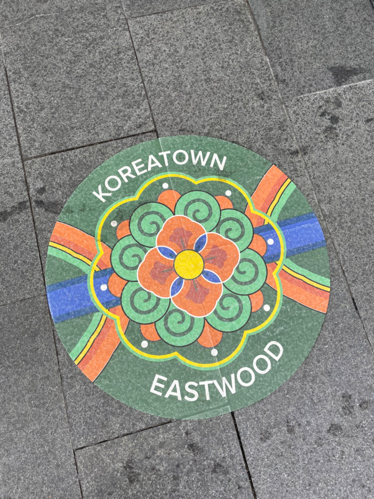
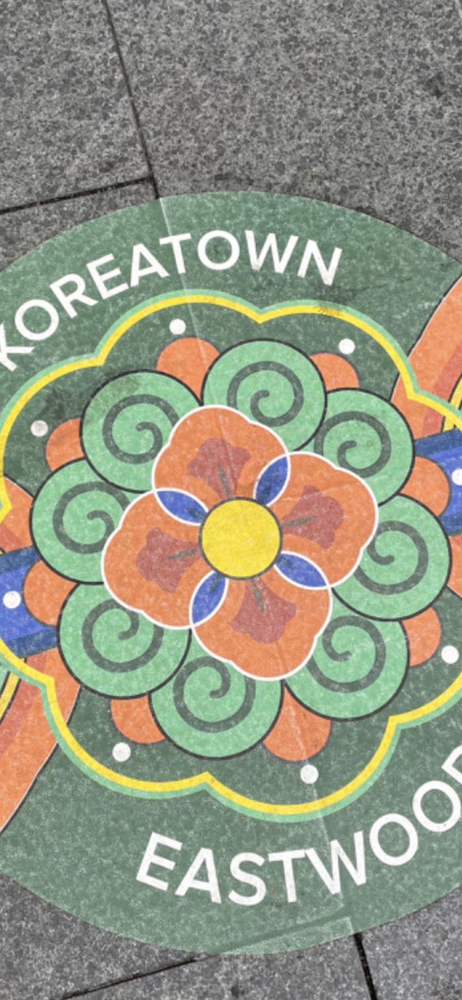
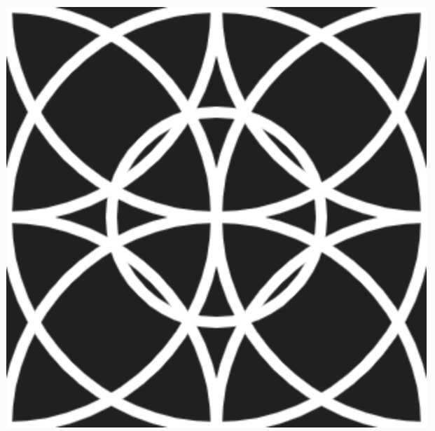

# Quiz-8
**Part 1: Imaging Technique Inspiration**
I choose a Korean cultural totem. It is a image that appears on Eastwood Koreatown. The colors used in this totem convey the national cultural characteristics of Korea. The shapes of the totem are diverse but regular. I want to apply it to my assignment to create a unique but comfortable visual sense.

**Part 2: Coding Technique Exploration**
I found an encoding for p5.js called circle. Through this coding, I can draw multiple shapes of circles or arcs in p5.js coding. I can apply this coding to imitate the Korean cultural totems drawn in the first part and achieve the superposition of multiple circles.

[link of example code](https://happycoding.io/tutorials/p5js/calling-functions/circles)